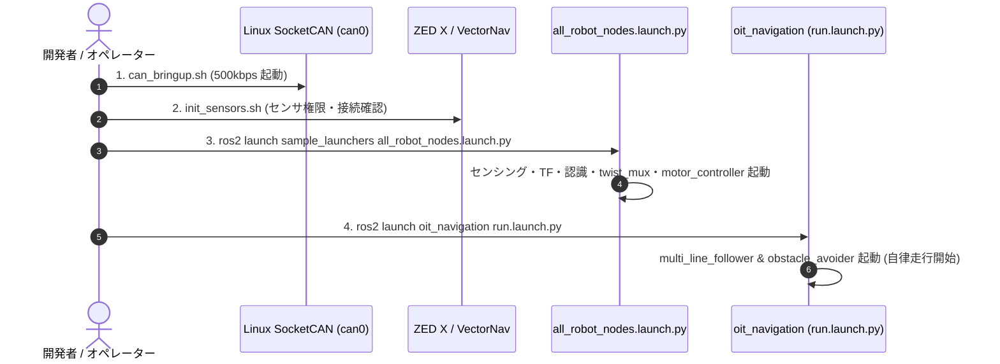

# 05. 起動手順 & Launchファイル構成

実機運用時およびシミュレーション時におけるノードの起動手順、Launchファイルの階層関係、便利なシェルスクリプトの一覧です。

---

## 🚀 1. 実機での基本起動フロー



---

## 🛠️ 2. コマンドライン手順

### ① CAN バスの初期化
```bash
# SocketCAN インターフェース (can0) を 500kbps / 1Mbps でアップ
sudo ip link set can0 up type can bitrate 500000
# または提供されているシェルスクリプトを実行:
bash src/launchers/sample_launchers/shellscript/can_bringup.sh
```

### ② 全体システム（センシング・認識・制御・TF）の起動
```bash
ros2 launch sample_launchers all_robot_nodes.launch.py
```
- **オプション引数**:
  - `autopilot:=true` : 自動操縦モードで起動
  - `use_sim_time:=true` : rosbag 再生時などのシミュレーション時刻を使用

### ③ ナビゲーション（自律レーン追従・障害物回避）の起動
```bash
ros2 launch oit_navigation run.launch.py
```

### ④ 手動ジョイスティック操縦（テスト時）
```bash
ros2 launch sample_launchers gamepad_teleop.launch.py
```

### ⑤ 走行データの rosbag 記録
```bash
# 1 コマンドでデータと画像の両方 -> rosbag/<日付_時刻>/<名前>/{data,image} (Ctrl+C で両方止まる)
bash launchers/sample_launchers/shellscript/record_rosbag.sh 6lane     # 6lane / qp / gamepad
# 別々の端末で取る場合
# 端末A: 画像以外 (走行方式ごと) -> rosbag/<日付_時刻>/<名前>/data
bash launchers/sample_launchers/shellscript/record_rosbag_6lane.sh     # 6レーン走行
bash launchers/sample_launchers/shellscript/record_rosbag_qp.sh        # 周回マップ+QP
bash launchers/sample_launchers/shellscript/record_rosbag_gamepad.sh   # 手動走行 (odom_imu_localizer も記録中だけ起動)
# 端末B: 画像 -> rosbag/<日付_時刻>/<名前>/image   (既定は JPEG 版, RAW=1 で生画像, RECORD_ANNOTATED=1 で注釈付き画像も)
bash launchers/sample_launchers/shellscript/record_rosbag_image.sh 6lane   # 6lane / qp / gamepad
```
画像以外は3種類とも IMU (ZED / VectorNav)・CANフレーム (車輪の実RPM)・gyro オドメトリ・TF・twist_mux の最終指令を共通で記録し、
それぞれの走行方式の認識・判断トピックを追加で記録します (共通部分は `record_rosbag_common.sh`)。
画像 (ZED 左画像・判断パネル) は別プロセスで記録し、小さいトピックの記録が画像の書き込みに引きずられないようにしています。

保存先はワークスペース直下の `rosbag/` (git 管理外)。Jetson ではコンテナの `/aiformula_machine` がホストの SSD 上のリポジトリなので、
内蔵ストレージを使わず、コンテナを作り直しても消えない。別の場所に保存するなら `ROSBAG_ROOT=/path/to/dir` を付けて実行する。

**別 PC (Dell 等) で記録・表示する場合**: Jetson と同じ LAN・`ROS_DOMAIN_ID=100` の Humble から上のスクリプトを実行する。
画像は既定で Jetson が出している JPEG 版 (`.../left_image/undistorted/compressed`, `.../panel/compressed`) を記録する。
生画像 (640x360 BGRA 約 0.9MB) は LAN 越しの DDS では 15Hz を運べず数 Hz に落ちる (Jetson 内では 15Hz 出ている) ので、
RViz2 / rqt_image_view でも別 PC では `/compressed` の方を表示すること。

---

## 📂 3. Launchファイル階層構造

```
all_robot_nodes.launch.py (統合エントリポイント)
├── vehicle_tf_broadcaster.launch.py   # 車両URDF/TFブロードキャスト
├── zedx_camera.launch.py              # ZED X ステレオカメラ
├── vectornav.launch.py                # VectorNav IMU/GNSS
├── socket_can_bridge.launch.py        # SocketCAN <-> ROS 2 CAN Frame
├── object_road_detector.launch.py     # YOLOP 道路/コーン認識
├── lane_line_publisher.launch.py      # 白線3次スプラインフィッティング
├── object_publisher.launch.py         # 3D物体位置同定
├── twist_mux.launch.py                # 速度指令多重化 & 安全ロック
└── motor_controller.launch.py         # 差動2輪 RPM変換 & CAN送信
```

---

## 📊 4. 便利な設定ファイル (YAML)

| 設定ファイルパス | 内容 |
| :--- | :--- |
| `launchers/sample_launchers/config/topic_list.yaml` | 全トピック名の一元管理 |
| `launchers/sample_launchers/config/frame_id_list.yaml` | 全TFフレーム名の一元管理 |
| `launchers/sample_launchers/config/twist_mux.yaml` | 速度指令の優先順位とタイムアウト設定 |
| `vehicles/sample_vehicle/config/wheel.yaml` | 車輪径、トレッド幅、ギヤ比パラメータ |
| `perception/lane_line_publisher/config/lane_line_publisher.yaml` | レーン抽出スキャン範囲、多項式フィッティング次数 |
