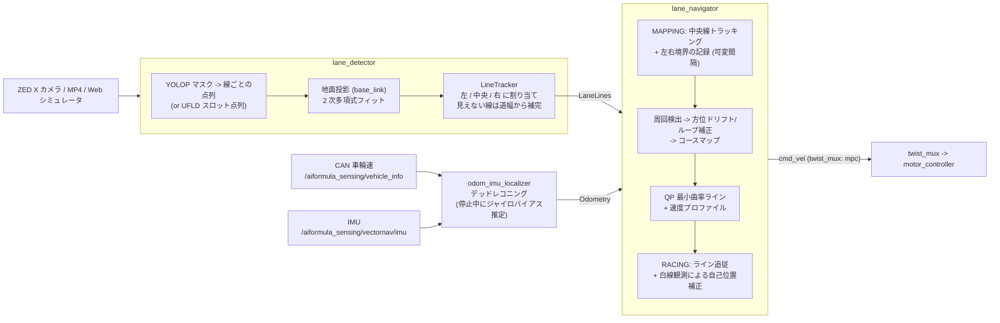

# oit_navigation (白線検出・周回マップ作成・QP レーシングライン走行・信号機検知)

AI Formula 向けの自律走行スタックです。

1. **白線検出** (`lane_detector`): カメラ画像から白線を検出し、**左境界 / 中央線 / 右境界** に割り当てる
   - `backend:=yolop` (既定・実機): `models/honda_shihou_finetuned_best.pth` (git 管理) の白線セグメンテーション
   - `backend:=ufld`: `models/ufld_honda_finetuned_best.pth` (UFLD v1, 245MB, git 管理外)
2. **1 周目** (`lane_navigator` MAPPING): 中央白線の上をレーントラッキング走行しながら、
   CAN 車輪速 + IMU で積算した自己位置 (`odom_imu_localizer`) を基準に、
   前方の **左境界点 (x_L, y_L) / 右境界点 (x_R, y_R)** を 2D で記録してマップを作る。
   直線は間隔を大きく (既定 3m)、カーブは間隔を詰めて (既定 0.6m) 落としていく。
3. **2 周目以降** (RACING): 記録した左右境界の各断面の道幅の中にウェイポイントを 1 点ずつ置き、
   **2 次計画法 (QP)** で曲率最小 = **アウト・イン・アウト** のラインを作って追従する。
4. **信号機距離推定** (`traffic_light_distance_node`): YOLO11n で赤/青信号を検出し距離を推定。
5. **赤信号停止** (`utils/traffic_light_stop.py`): 赤信号までの距離から、信号機の **7.0m 手前 (許容 5〜10m)** で止まる。
   `lane_navigator` と 6レーン走行の `six_lane_planner` の両方が、最終 cmd_vel にこの速度上限を掛ける。

アルゴリズム本体 (`oit_navigation/lane_nav/`) は ROS 非依存で、Web シミュレータの
`web_simulator/js/lane_navigator.js` が同じ処理・同じパラメータで動きます (JS/Python で結果一致を確認済み)。

---

## 🏎️ システム構成



### ノード

| ノード | 入力 | 出力 |
| :--- | :--- | :--- |
| `lane_detector` | カメラ画像 (Image / CompressedImage) | `/aiformula_perception/lane_detector/lane_lines` (`aiformula_interfaces/LaneLines`)<br>`/aiformula_perception/lane_line_publisher/lane_lines/{left,center,right}` (Path, base_link)<br>`/aiformula_visualization/lane_detector/annotated_image` |
| `odom_imu_localizer` | `/aiformula_sensing/vehicle_info` (CAN), `/aiformula_sensing/vectornav/imu` | `/aiformula_sensing/odom_imu_localizer/odom` (Odometry) |
| `lane_navigator` | LaneLines, Odometry | `/aiformula_control/extremum_seeking_mpc/cmd_vel` (twist_mux の `mpc` 入力, 優先度 50)<br>`/aiformula_control/lane_tracker/status` (String, JSON)<br>`/aiformula_visualization/lane_navigator/{left,right}_boundary`, `/aiformula_visualization/target_trajectory` (Path, odom)<br>サービス `/lane_navigator/finish_mapping`, `/lane_navigator/reset` (std_srvs/Trigger) |
| `traffic_light_distance_node` | カメラ画像 | `/aiformula_perception/traffic_light/{nearest,red,green}_distance` (Float32), `status` |
| `cone_detector` | カメラ画像 | `/aiformula_perception/cone_detector/cones` (PoseArray, base_link), `status` (JSON)<br>`/aiformula_visualization/cone_detector/{markers,annotated_image}` |
| (`lane_navigator` / `six_lane_planner` 内) 赤信号停止 | `/aiformula_perception/traffic_light/{red,green}_distance` | cmd_vel に速度上限, `/aiformula_control/traffic_light_stop/status` (String, JSON) |
| `video_publisher` / `image_compressor_node` / `verification_gui` | 動画検証・配信用 | |

---

## 🧠 アルゴリズム (`oit_navigation/lane_nav/`)

| モジュール | 内容 |
| :--- | :--- |
| `geometry.py` | 画像点 -> 地面 (base_link) のピンホール + 平面投影 (BEV 画像は作らず点だけ投影)、2 次多項式フィット |
| `mask_lines.py` | YOLOP の白線マスクを下から上へ行スキャンし、白線ごとの点列につなぐ |
| `line_tracker.py` | 検出線を横位置で左/中央/右に割り当て (予測位置ゲート・順序・**道幅整合・平行性** で分岐線などを除外)。見えない線は道幅から補完 |
| `boundary_recorder.py` | 前方 `x_rec` の左右境界を odom 座標に記録。曲率 (ヨーレート/速度 と 白線曲率) で間隔を 3.0m〜0.6m に可変 |
| `course_map.py` | 周回検出、**ループ閉じ込み** (横ずれを走行距離比例で配分)、方位ドリフト補正 (スタート時と 1 周後の中央線の絶対方位差。白線の向きの推定ノイズが大きいため既定 off = `lap.yaw_drift_correction`)、JSON 保存/読込 |
| `raceline_qp.py` | 断面 i のウェイポイント `P_i = L_i + α_i (R_i − L_i)`、`α_i ∈ [m_i, 1−m_i]` (車幅+マージン) で不等間隔 2 階差分の二乗和 (≒曲率) を最小化する箱制約 QP を FISTA で解く。速度は横加速度上限と加減速制限で整形 |
| `path_tracker.py` | ウェイポイントを Catmull-Rom で補間し、前方注視点への円弧で角速度を出す |
| `navigator.py` | MAPPING → OPTIMIZING → RACING の状態遷移、2 周目以降の白線観測による自己位置補正 (点-線 ICP。誤対応で暴走しないよう 1 更新 3cm / 0.005rad まで・2 本以上の線が対応したときだけ) |

---

## 🚀 使い方

```bash
colcon build --packages-select aiformula_interfaces oit_navigation --symlink-install
source install/setup.bash
```

### 実機
```bash
ros2 launch oit_navigation navigation.launch.py use_device:=0 use_tensorrt:=true
# 1 周目のマップを保存 / 保存済みマップで 2 周目から開始
ros2 launch oit_navigation navigation.launch.py map_save_path:=~/aiformula_maps/course.json
ros2 launch oit_navigation navigation.launch.py map_load_path:=~/aiformula_maps/course.json
# 周回検出がドリフトで成立しないときは手動で 1 周目を終了
ros2 service call /lane_navigator/finish_mapping std_srvs/srv/Trigger
```
- スタート時は **中央白線の上** に車両を置き、数秒停止してから走り出す (ジャイロバイアス推定)。
- 中央線 <-> 境界線の距離の初期値は `lane_width` (既定 3.5m、走行中に推定更新)。

### Web シミュレータ (システム構成・技術の組み合わせの検証)
- ブラウザ内だけで完結: `web_simulator/` の「自動運転」タブで検出器 (YOLOP / UFLD / 理想検出) を選び「スタート位置へ」→「自動運転: ON」
- ROS 2 ノードで動かす: `make rosbridge` → シミュレータで「接続」→ `make sim-nav` → 「ROS2連携」

### 動画 (白線検出の確認のみ)
```bash
ros2 launch oit_navigation video_test.launch.py backend:=yolop traffic_light:=false
ros2 run oit_navigation verification_gui   # http://localhost:8090
```

### 6レーン動的選択走行 (地図なし・オドメトリなし)
周回マップ + QP とは別の走行方式. 白線から仮想6レーンを作り, NN がアウト・イン・アウトになるレーンを選ぶ.
詳細は [`oit_navigation/6lane/README.md`](oit_navigation/6lane/README.md).
```bash
ros2 launch oit_navigation six_lane.launch.py use_device:=0 use_tensorrt:=true   # lane_navigator とは同時起動しない
```

### テスト
```bash
python3 -m pytest src/oit_navigation/test/test_lane_nav.py      # ROS 不要
python3 -m pytest src/oit_navigation/test/test_six_lane.py      # 6レーン (ROS 不要)
python3 src/oit_navigation/test/lane_nav_sim.py --plot /tmp/sim.png   # オフライン 2D シミュレーション
```

---

## ⚙️ 設定ファイル

- [`config/navigation_params.yaml`](config/navigation_params.yaml): `lane_detector` / `odom_imu_localizer` / `lane_navigator` の全パラメータ
  (変更したら `web_simulator/js/lane_navigator.js` の `*_PARAMS` も合わせる)
- [`config/traffic_light_params.yaml`](config/traffic_light_params.yaml): 信号機モデル・距離係数

## 🚧 コーン回避 (`oit_navigation/lane_nav/cone_avoidance.py`)

`web_simulator/js/cone_avoidance.js` と同一 (定数・計算とも。同じ入力で出力一致を確認済み)。
`cone_detector` の `/aiformula_perception/cone_detector/cones` (PoseArray, base_link) を使う。

| 段 | 周回マップ + QP (`lane_navigator`) | 6レーン (`six_lane_planner`) |
| :--- | :--- | :--- |
| 反応的回避 (毎周期) | 前方 7m 以内で進路 (±1.0m) にかかるコーン群を, 半径 1.0m の禁止円の外周に沿って抜ける操舵を足す (近いと 0.6m/s に減速) | 同じ (レーン除外の上に重ねる最終安全層) |
| 1 周目の記憶 | 見えたコーンを記録し, 周回完了時にコースマップと**同じ補正** (方位ドリフト補正は地図が掛けたときだけ + ループ閉じ込み) でコーン地図にする | - |
| 2 周目のライン | QP ラインを細かく (0.2m) してから, コーンの左右のうちコースに収まる側へ **1.3m** 離れるよう前後 4.5m のこぶで押し出す | コーンで塞がれたレーンを除外 |
| 2 周目の自己位置 | 見えたコーンを地図のコーンと照合して (x, y) を補正 | - |

- パラメータは `navigation_params.yaml` の `lane_navigator` の `cone_avoidance.*` (反応的回避・ライン押し出し・自己位置補正をそれぞれ無効にできる)
- `map_save_path` でマップを保存すると, 2 周目に入った時点でコーン地図も同じ JSON (`"cones"`) に書き足す。
  `map_load_path` で再開してもコーンを避ける
- オフライン周回テスト (`test/test_cone_avoidance.py`): 中央線上・左寄り・右寄りの 3 個のコーンで, 1 周目も 2 周目以降も
  車体がコーンに触れず (コーン中心から 0.5m 以上) コース内に収まる

## 🔍 走行後に判断を確認する (rosbag + RViz2)

実機で走らせたときの **認識 (白線・コーン・信号と距離)** と **判断 (レーン選択・QP の状態・信号停止)** を、
後から rosbag を再生して RViz2 で確かめられるように、各ノードが可視化用のトピックを出します。

| 何を確認するか | トピック | RViz2 での見え方 |
| :--- | :--- | :--- |
| 白線 (左/中央/右) | `/aiformula_perception/lane_line_publisher/lane_lines/*` | 線 (base_link) |
| コーンの認識と距離 | `/aiformula_visualization/cone_detector/markers`<br>`/aiformula_visualization/cone_detector/annotated_image` | オレンジの円柱 + 「4.0m (0.83)」(距離, 信頼度)<br>カメラ画像に枠と距離 (x, y) |
| 信号の認識と距離 | `/aiformula_visualization/traffic_light/annotated_image`<br>`/aiformula_visualization/traffic_light_stop/markers` | カメラ画像に枠と距離<br>赤/青の球 + 「RED 7.3m」, 停止予定位置の黄色い線, 状態 (NORMAL/APPROACH/STOPPED/RESUME) |
| 6レーンの判断 | `/aiformula_visualization/six_lane_planner/markers`<br>`/aiformula_visualization/six_lane_planner/panel`<br>`/aiformula_visualization/six_lane_planner/target_path` | 仮想6レーンの境界, 現在 (緑)/目標 (橙)/コーンで塞がれた (赤) レーン, 各レーンの確率, 注視点<br>**判断パネル画像**: 俯瞰図 + 確率バー + 日本語の判断理由 (シミュレータ右下と同じ)<br>目標レーンの中心線 |
| 周回マップ + QP の判断 | `/aiformula_visualization/lane_navigator/{panel,markers}`<br>境界・レーシングライン (odom) | 判断パネル画像 (状態・周回・速度・信号を日本語で) + 車の上の要約 |

判断の中身は JSON でも出ています (`ros2 topic echo` や rosbag から読める):
`/aiformula_control/six_lane_planner/status` (6レーンの判断 + 日本語の理由 `explain`)、
`/aiformula_control/lane_tracker/status` (QP)、`/aiformula_control/traffic_light_stop/status`、
`/aiformula_perception/cone_detector/status` (各コーンの x, y, 距離, 信頼度, bbox)、`/aiformula_perception/traffic_light/status`。

```bash
# 事前に 1 回: 判断パネルの日本語フォント (無いと日本語が ? になる)
sudo apt install fonts-noto-cjk

# 走行 (RViz も起動する)
ros2 launch oit_navigation six_lane.launch.py use_device:=0 use_tensorrt:=true      # 6レーン
ros2 launch oit_navigation navigation.launch.py use_device:=0 use_tensorrt:=true    # 周回マップ + QP

# 記録 (別端末). センサ + 上の認識/判断トピック. 注釈付き画像 (フル解像度で重い) も残すなら RECORD_ANNOTATED=1
launchers/sample_launchers/shellscript/record_rosbag.sh run1

# 再生して確認
ros2 bag play ~/rosbag/<日付>/run1 --clock
rviz2 -d $(ros2 pkg prefix oit_navigation)/share/oit_navigation/config/six_lane.rviz --ros-args -p use_sim_time:=true
rviz2 -d $(ros2 pkg prefix oit_navigation)/share/oit_navigation/config/oit_navigation.rviz --ros-args -p use_sim_time:=true
```

- `six_lane.rviz` は Fixed Frame が `base_link` (すべて車体座標なので TF 無しで見える)。
  `oit_navigation.rviz` は `base_footprint` で、境界・レーシングライン (odom) の表示に記録した `/tf` を使う
- 注釈付き画像を記録しなかった場合は、カメラ画像 (`Camera (raw, rosbag)`, 既定は非表示) を有効にして見る。
  検出からやり直して見たいときは、センサだけ再生しながら launch を起動すれば同じ可視化が作り直される
- コーンの位置は「バウンディングボックス下辺の中央を地面に投影」なので、`cone_detector` の `camera_*` は
  `lane_detector` と同じ値にしておくこと (navigation_params.yaml)
- 信号の横位置は分からない (距離だけ) ので、RViz では正面に置いて表示する

## 🚦 赤信号停止 (`oit_navigation/utils/traffic_light_stop.py`)

ROS 非依存の状態機械で、`web_simulator/js/traffic_light_stop.js` と同一です。ROS 側の組み込みは
`utils/traffic_light_stop_ros.py` (パラメータ宣言・距離トピック購読・status 配信) で、`lane_navigator` と `six_lane_planner` が
cmd_vel を出す直前に `apply()` を呼びます。パラメータは各ノードの `traffic_light_stop.*`
(`navigation_params.yaml` / `6lane/config/six_lane_params.yaml`)。

| 状態 | 内容 |
| :--- | :--- |
| `NORMAL` | 制限なし。赤を連続 `red_confirm_frames` (2) 回見たら `APPROACH` (1 回だけの誤検出では止まらない) |
| `APPROACH` | `v <= sqrt(2 * decel * (d - stop_distance))` で減速。検出の合間は車輪速で距離を補間。旋回は曲率 (omega/v) を保って縮める |
| `STOPPED` | v = omega = 0。青を連続 2 回見るか、赤が `red_release_time` (3 秒) 見えなくなったら発進 |
| `RESUME` | 速度上限を `resume_accel` で戻し、走行側の指令に追いついたら `NORMAL` |

- 赤を**初めて見た距離** (連続検出の 1 フレーム目) が `min_trigger_distance` (**5m**) より近ければ、止まらずに**通過**する
  (止まっても 5m を割るため)。5m 以上なら停止目標 7.0m より近くても (直前で赤に変わった等) 止まれる限り止まる
- **実機の距離校正に注意**: `traffic_light_params.yaml` の `focal_length_y` (2238.5) は **20m** で校正した値です。
  YOLO のボックスは小さい物体ほど大きめに出るため、20m で合わせると停止帯 (5〜10m) では距離を**長め**に見積もり、
  信号に近づきすぎる可能性があります。実機ではパネルを **7m 前後に置いて** 表示距離が合うよう `focal_length_y` を校正し直してください
  (シミュレータでは同じ理由で幾何値 763px ではなく 900px に校正)

## 🛠️ モデル関連スクリプト

- `ros2 run oit_navigation export_tensorrt`: YOLOP -> TensorRT エンジン (Jetson。`use_tensorrt:=true` なら初回起動時に自動実行)
- `ros2 run oit_navigation export_onnx_web`: YOLOP -> `web_simulator/models/honda_shihou_finetuned.onnx`
- `ros2 run oit_navigation export_ufld_onnx`: UFLD -> `web_simulator/models/ufld.onnx` (245MB, git 管理外)
