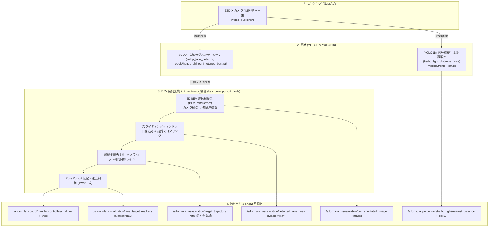

# oit_navigation (自律走行・白線認識・追従制御・信号機検知)

AI Formula 向け **Vision-Only 2D BEV レーン追従・YOLOP 白線認識・Pure Pursuit 制御・YOLO 信号機距離推定** パッケージです。

3D 点群（PointCloud2）や外部オドメトリに依存せず、車載カメラ（またはテスト用 MP4 動画）の映像から **YOLOP による白線セグメンテーション、2D 鳥瞰図（BEV）変換、スライディングウィンドウ白線追跡、道幅 3.5m 綺麗側優先オフセット補間、Pure Pursuit 経路追従制御、YOLO11n 信号機検知・距離推定、および RViz2 / Web GUI でのリアルタイム可視化** を提供します。

---

## 🏎️ システムアーキテクチャ



---

## 📡 入出力トピック一覧

### 入力トピック
| トピック名 | メッセージ型 | 説明 |
| :--- | :--- | :--- |
| `/aiformula_sensing/zed_node/left_image/undistorted` | `sensor_msgs/msg/Image` | カメラの入力カラー画像（非圧縮） |
| `/aiformula_sensing/zed_node/left_image/undistorted/compressed` | `sensor_msgs/msg/CompressedImage` | カメラの入力カラー画像（圧縮） |
| `/aiformula_perception/object_road_detector/mask_image` | `sensor_msgs/msg/Image` | YOLOP による白線セグメンテーションマスク画像 |

### 出力トピック
| トピック名 | メッセージ型 | 説明 |
| :--- | :--- | :--- |
| `/aiformula_control/handle_controller/cmd_vel` | `geometry_msgs/msg/Twist` | 車両への速度・操舵角速度指令 |
| `/aiformula_control/lane_tracker/status` | `std_msgs/msg/String` | 走行モード・指令速度・曲率ステータス (JSON) |
| `/aiformula_perception/traffic_light/nearest_distance` | `std_msgs/msg/Float32` | 最も近い信号機までの推定距離 [m] |
| `/aiformula_perception/traffic_light/red_distance` | `std_msgs/msg/Float32` | 最も近い赤信号までの推定距離 [m] |
| `/aiformula_perception/traffic_light/green_distance` | `std_msgs/msg/Float32` | 最も近い青信号までの推定距離 [m] |
| `/aiformula_visualization/target_trajectory` | `nav_msgs/msg/Path` | 綺麗側から 1.75m オフセットされた目標走行ライン（鮮やかな緑） |
| `/aiformula_visualization/detected_lane_lines` | `visualization_msgs/msg/MarkerArray` | 検出白線ラインストリップ（左: シアン, 右: イエロー） |
| `/aiformula_visualization/lane_target_markers` | `visualization_msgs/msg/MarkerArray` | 車両原点（0m）および前方注視点（5.0m）の目標球体マーカー |
| `/aiformula_visualization/bev_annotated_image` | `sensor_msgs/msg/Image` | BEV 俯瞰認識オーバーレイ画像 |
| `/aiformula_perception/traffic_light/annotated_image` | `sensor_msgs/msg/Image` | 信号機検出枠と推定距離のオーバーレイ画像 |

---

## 🚀 使い方

### 1. ビルド & 環境設定
```bash
# Docker コンテナ内 (/aiformula_machine) で実行
colcon build --packages-select oit_navigation --symlink-install
source install/setup.bash
```

---

### 2. PC 単体での動画検証（実機不要）

#### 【方法 A】Web 検証 GUI を使う（おすすめ）
ブラウザ上で動画の選択、検証パイプライン（白線 / 信号機 / 統合）の切り替え、起動・停止がワンクリックで行えます。

```bash
ros2 run oit_navigation verification_gui
```
👉 ホスト PC のブラウザで [http://localhost:8090](http://localhost:8090) を開きます。
同時に RViz2 画面を [http://localhost:8080](http://localhost:8080) (noVNC) で確認できます。

---

#### 【方法 B】CLI から動画検証 Launch を実行する
目的に応じて 4 つの検証 launch を使い分けられます。

| # | 検証内容 | 実行コマンド |
| :--- | :--- | :--- |
| **① 信号機単体** | 信号機検出 (bbox・占有率・距離) の確認 | `ros2 launch oit_navigation traffic_light_video_test.launch.py` |
| **② YOLOP単体** | 白線・走路セグメンテーション認識の確認 | `ros2 launch oit_navigation yolop_video_test.launch.py` |
| **③ 白線 ＋ 制御** | 白線認識から目標経路・Twist生成まで (信号機OFF) | `ros2 launch oit_navigation video_test.launch.py traffic_light:=false` |
| **④ フル統合** | 全ノード（白線＋信号機＋追従制御＋RViz2）の一括動作 | `ros2 launch oit_navigation video_test.launch.py` |

**主要な引数オプション:**
- `video_path:=/path/to/video.mp4`: テスト対象動画のパスを指定
- `use_device:=cpu` (または `cuda`, `mps`, `0`): 推論デバイスを指定
- `rviz:=false`: RViz2 を起動しない場合

---

### 3. 実機（実車機体）での起動

実機カメラ（ZED X）のトピックを受信して自律走行ノードを動かします。

```bash
# GPU (CUDA) を使用して自律走行スタックを起動
ros2 launch oit_navigation navigation.launch.py use_device:=0
```

---

## 🧠 主要アルゴリズムの仕組み

### 1. 2D BEV 変換 ＆ Pure Pursuit レーン追従 (`bev_pure_pursuit_node`)
1. **IPM (Inverse Perspective Mapping) 変換**:
   - カメラ視点のセグメンテーションマスクを、ホモグラフィ変換により車両直上の 2D 俯瞰（BEV）座標系に射影します。
2. **スライディングウィンドウ白線追跡**:
   - 左右の白線ピクセル群を底面から上方へウィンドウ追跡し、曲率・連続性・点数をスコアリングして「左線」「右線」を同定します。
3. **綺麗側優先 3.5m 幅オフセット補間**:
   - コース幅（3.5m）を基準とし、白線が片側しか綺麗に見えない場合でも、信頼度の高い側のラインから 1.75m オフセットして目標ライン（緑色の Path）を正確に生成します。
4. **Pure Pursuit 操舵制御**:
   - 前方注視点（Lookahead Distance）に向けた幾何学的円弧軌道から操舵角速度指令（`angular.z`）を算出し、カーブ曲率に応じた減速制御（`linear.x`）を行います。

### 2. YOLO11n 信号機検出 ＆ 距離推定 (`traffic_light_distance_node`)
- 学習済みモデル `models/traffic_light.pt` を使用し、赤信号・青信号を検出します。
- **正方形信号機（1辺 32cm）の画像内縦占有率** からピンホールカメラ幾何モデルを用いて信号機までの距離 [m] を逆算します。

$$\text{occupancy} = \frac{\text{bbox\_height\_px}}{\text{image\_height\_px}}$$

$$\text{distance} = \frac{\text{distance\_coeff}}{\text{occupancy}}$$

- カメラパラメータは ZED X (2.2mm レンズ / AR0234) を基準に設定されています（`focal_length_y: 733.0`, `reference_image_height: 1080`）。

---

## ⚙️ 設定ファイル一覧

- [`config/navigation_params.yaml`](file:///Users/miyanswer/aiformula_machine/src/oit_navigation/config/navigation_params.yaml):
  - BEV 射影行列パラメータ、スライディングウィンドウ設定、Pure Pursuit ゲイン・注視距離、最高速度・最低速度設定
- [`config/traffic_light_params.yaml`](file:///Users/miyanswer/aiformula_machine/src/oit_navigation/config/traffic_light_params.yaml):
  - 信号機モデルパス、信頼度閾値、信号機実寸（32cm）、カメラ焦点距離・距離係数
