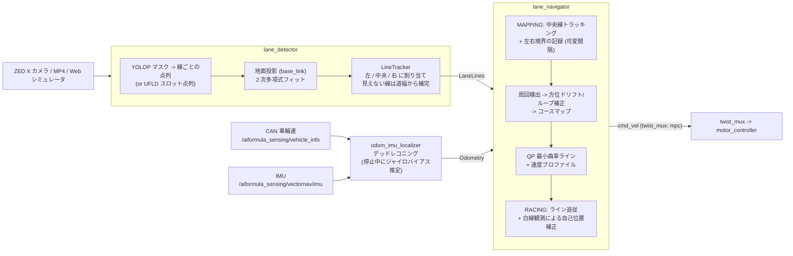

# oit_navigation (白線検出・周回マップ作成・QP レーシングライン走行・信号機検知)

AI Formula 向けの自律走行スタックです。

1. **白線検出** (`lane_detector`): カメラ画像から白線を検出し、**左境界 / 中央線 / 右境界** に割り当てる
   - `backend:=yolop` (既定・実機): `models/honda_shihou_finetuned_best.pth` (git 管理) の白線セグメンテーション
   - `backend:=ufld`: `models/ufld_honda_finetuned_best.pth` (UFLD v1, 245MB, git 管理外)
2. **1 周目** (`lane_navigator` MAPPING): 中央白線の上をレーントラッキング走行しながら、
   CAN 車輪速 + IMU で積算した自己位置 (`odom_imu_localizer`) を基準に、
   前方の **左境界点 (x_L, y_L) / 右境界点 (x_R, y_R)** を 2D で記録してマップを作る。
   直線は間隔を大きく (既定 3m)、カーブは間隔を詰めて (既定 0.6m) 落としていく。
3. **2 周目以降** (RACING): 記録した左右境界の各断面の道幅の中にウェイポイントを 1 点ずつ置き、
   **2 次計画法 (QP)** で曲率最小 = **アウト・イン・アウト** のラインを作って追従する。
4. **信号機距離推定** (`traffic_light_distance_node`): YOLO11n で赤/青信号を検出し距離を推定。

アルゴリズム本体 (`oit_navigation/lane_nav/`) は ROS 非依存で、Web シミュレータの
`web_simulator/js/lane_navigator.js` が同じ処理・同じパラメータで動きます (JS/Python で結果一致を確認済み)。

---

## 🏎️ システム構成



### ノード

| ノード | 入力 | 出力 |
| :--- | :--- | :--- |
| `lane_detector` | カメラ画像 (Image / CompressedImage) | `/aiformula_perception/lane_detector/lane_lines` (`aiformula_interfaces/LaneLines`)<br>`/aiformula_perception/lane_line_publisher/lane_lines/{left,center,right}` (Path, base_link)<br>`/aiformula_visualization/lane_detector/annotated_image` |
| `odom_imu_localizer` | `/aiformula_sensing/vehicle_info` (CAN), `/aiformula_sensing/vectornav/imu` | `/aiformula_sensing/odom_imu_localizer/odom` (Odometry) |
| `lane_navigator` | LaneLines, Odometry | `/aiformula_control/extremum_seeking_mpc/cmd_vel` (twist_mux の `mpc` 入力, 優先度 50)<br>`/aiformula_control/lane_tracker/status` (String, JSON)<br>`/aiformula_visualization/lane_navigator/{left,right}_boundary`, `/aiformula_visualization/target_trajectory` (Path, odom)<br>サービス `/lane_navigator/finish_mapping`, `/lane_navigator/reset` (std_srvs/Trigger) |
| `traffic_light_distance_node` | カメラ画像 | `/aiformula_perception/traffic_light/*` |
| `video_publisher` / `image_compressor_node` / `verification_gui` | 動画検証・配信用 | |

---

## 🧠 アルゴリズム (`oit_navigation/lane_nav/`)

| モジュール | 内容 |
| :--- | :--- |
| `geometry.py` | 画像点 -> 地面 (base_link) のピンホール + 平面投影 (BEV 画像は作らず点だけ投影)、2 次多項式フィット |
| `mask_lines.py` | YOLOP の白線マスクを下から上へ行スキャンし、白線ごとの点列につなぐ |
| `line_tracker.py` | 検出線を横位置で左/中央/右に割り当て (予測位置ゲート・順序・**道幅整合・平行性** で分岐線などを除外)。見えない線は道幅から補完 |
| `boundary_recorder.py` | 前方 `x_rec` の左右境界を odom 座標に記録。曲率 (ヨーレート/速度 と 白線曲率) で間隔を 3.0m〜0.6m に可変 |
| `course_map.py` | 周回検出、**ループ閉じ込み** (横ずれを走行距離比例で配分)、方位ドリフト補正 (スタート時と 1 周後の中央線の絶対方位差。白線の向きの推定ノイズが大きいため既定 off = `lap.yaw_drift_correction`)、JSON 保存/読込 |
| `raceline_qp.py` | 断面 i のウェイポイント `P_i = L_i + α_i (R_i − L_i)`、`α_i ∈ [m_i, 1−m_i]` (車幅+マージン) で不等間隔 2 階差分の二乗和 (≒曲率) を最小化する箱制約 QP を FISTA で解く。速度は横加速度上限と加減速制限で整形 |
| `path_tracker.py` | ウェイポイントを Catmull-Rom で補間し、前方注視点への円弧で角速度を出す |
| `navigator.py` | MAPPING → OPTIMIZING → RACING の状態遷移、2 周目以降の白線観測による自己位置補正 (点-線 ICP。誤対応で暴走しないよう 1 更新 3cm / 0.005rad まで・2 本以上の線が対応したときだけ) |

---

## 🚀 使い方

```bash
colcon build --packages-select aiformula_interfaces oit_navigation --symlink-install
source install/setup.bash
```

### 実機
```bash
ros2 launch oit_navigation navigation.launch.py use_device:=0 use_tensorrt:=true
# 1 周目のマップを保存 / 保存済みマップで 2 周目から開始
ros2 launch oit_navigation navigation.launch.py map_save_path:=~/aiformula_maps/course.json
ros2 launch oit_navigation navigation.launch.py map_load_path:=~/aiformula_maps/course.json
# 周回検出がドリフトで成立しないときは手動で 1 周目を終了
ros2 service call /lane_navigator/finish_mapping std_srvs/srv/Trigger
```
- スタート時は **中央白線の上** に車両を置き、数秒停止してから走り出す (ジャイロバイアス推定)。
- 中央線 <-> 境界線の距離の初期値は `lane_width` (既定 3.5m、走行中に推定更新)。

### Web シミュレータ (システム構成・技術の組み合わせの検証)
- ブラウザ内だけで完結: `web_simulator/` の「自動運転」タブで検出器 (YOLOP / UFLD / 理想検出) を選び「スタート位置へ」→「自動運転: ON」
- ROS 2 ノードで動かす: `make rosbridge` → シミュレータで「接続」→ `make sim-nav` → 「ROS2連携」

### 動画 (白線検出の確認のみ)
```bash
ros2 launch oit_navigation video_test.launch.py backend:=yolop traffic_light:=false
ros2 run oit_navigation verification_gui   # http://localhost:8090
```

### テスト
```bash
python3 -m pytest src/oit_navigation/test/test_lane_nav.py      # ROS 不要
python3 src/oit_navigation/test/lane_nav_sim.py --plot /tmp/sim.png   # オフライン 2D シミュレーション
```

---

## ⚙️ 設定ファイル

- [`config/navigation_params.yaml`](config/navigation_params.yaml): `lane_detector` / `odom_imu_localizer` / `lane_navigator` の全パラメータ
  (変更したら `web_simulator/js/lane_navigator.js` の `*_PARAMS` も合わせる)
- [`config/traffic_light_params.yaml`](config/traffic_light_params.yaml): 信号機モデル・距離係数

## 🛠️ モデル関連スクリプト

- `ros2 run oit_navigation export_tensorrt`: YOLOP -> TensorRT エンジン (Jetson。`use_tensorrt:=true` なら初回起動時に自動実行)
- `ros2 run oit_navigation export_onnx_web`: YOLOP -> `web_simulator/models/honda_shihou_finetuned.onnx`
- `ros2 run oit_navigation export_ufld_onnx`: UFLD -> `web_simulator/models/ufld.onnx` (245MB, git 管理外)
