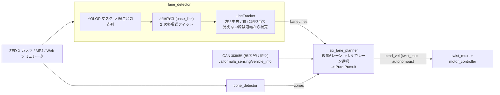

# oit_navigation (白線検出・6レーン動的選択走行・コーン/信号機検知)

AI Formula 向けの自律走行スタックです。

1. **白線検出** (`lane_detector`): カメラ画像から白線を検出し、**左境界 / 中央線 / 右境界** に割り当てる
   - YOLOP: `models/honda_shihou_finetuned_best.pth` (git 管理) の白線セグメンテーション (UFLD は廃止)
2. **6レーン動的選択走行** (`six_lane_planner`): 地図もオドメトリも使わず、その瞬間の白線から仮想6レーンを作り、
   NN が **アウト・イン・アウト** になるレーンを選んで追従する (詳細は [`oit_navigation/6lane/README.md`](oit_navigation/6lane/README.md))。
   ※ 以前あった「1 周目に地図を作り 2 周目に QP レーシングラインを追従する」方式 (`lane_navigator`) は廃止した。
3. **コーン検出** (`cone_detector`): `cone.pt` でコーンを検出し位置を推定。`six_lane_planner` が塞がれたレーンを避ける。
4. **信号機距離推定** (`traffic_light_distance_node`): YOLO11n で赤/青信号を検出し距離を推定。
5. **赤信号停止** (`utils/traffic_light_stop.py`): 赤信号までの距離から、信号機の **7.0m 手前 (許容 5〜10m)** で止まる。
   `six_lane_planner` が最終 cmd_vel にこの速度上限を掛ける。

アルゴリズム本体 (`oit_navigation/lane_core/`) は ROS 非依存で、Web シミュレータの
`web_simulator/js/` (`lane_core.js` = 白線追跡, `six_lane_planner.js`) が同じ処理・同じパラメータで動きます。

---

## 🏎️ システム構成


```mermaid
flowchart LR
    CAM["ZED X カメラ / MP4 / Web シミュレータ"] --> DET
    CAM --> CONE
    CAN["CAN 車輪速 (速度だけ使う)<br>/aiformula_sensing/vehicle_info"]

    subgraph DET ["lane_detector"]
        B["YOLOP マスク -> 線ごとの点列"] --> P["地面投影 (base_link)<br>2 次多項式フィット"] --> T["LineTracker<br>左 / 中央 / 右 に割り当て<br>見えない線は道幅から補完"]
    end
    T -->|LaneLines| NAV["six_lane_planner<br>仮想6レーン -> NN でレーン選択<br>-> Pure Pursuit"]
    CAN --> NAV
    CONE["cone_detector"] -->|cones| NAV
    NAV -->|"cmd_vel (twist_mux: autonomous)"| MUX["twist_mux -> motor_controller"]
```

### ノード

| ノード | 入力 | 出力 |
| :--- | :--- | :--- |
| `lane_detector` | カメラ画像 (Image / CompressedImage) | `/aiformula_perception/lane_detector/lane_lines` (`aiformula_interfaces/LaneLines`)<br>`/aiformula_perception/lane_line_publisher/lane_lines/{left,center,right}` (Path, base_link)<br>`/aiformula_visualization/lane_detector/annotated_image` |
| `six_lane_planner` | LaneLines, CAN 車輪速, cones | `/aiformula_control/six_lane_planner/cmd_vel` (twist_mux の `autonomous` 入力, 優先度 50)<br>`/aiformula_control/six_lane_planner/status` (String, JSON)<br>`/aiformula_visualization/six_lane_planner/{markers,panel,target_path}` |
| `traffic_light_distance_node` | カメラ画像 | `/aiformula_perception/traffic_light/{nearest,red,green}_distance` (Float32), `status` |
| `cone_detector` | カメラ画像 | `/aiformula_perception/cone_detector/cones` (PoseArray, base_link), `status` (JSON)<br>`/aiformula_visualization/cone_detector/{markers,annotated_image}` |
| (`six_lane_planner` 内) 赤信号停止 | `/aiformula_perception/traffic_light/{red,green}_distance` | cmd_vel に速度上限, `/aiformula_control/traffic_light_stop/status` (String, JSON) |
| `video_publisher` / `image_compressor_node` / `verification_gui` | 動画検証・配信用 | |

---

## 🧠 アルゴリズム (`oit_navigation/lane_core/`)

| モジュール | 内容 |
| :--- | :--- |
| `geometry.py` | 画像点 -> 地面 (base_link) のピンホール + 平面投影 (BEV 画像は作らず点だけ投影)、2 次多項式フィット |
| `mask_lines.py` | YOLOP の白線マスクを下から上へ行スキャンし、白線ごとの点列につなぐ |
| `line_tracker.py` | 検出線を横位置で左/中央/右に割り当て (予測位置ゲート・順序・**道幅整合・平行性** で分岐線などを除外)。見えない線は道幅から補完 |
| `cone_avoidance.py` | コーン群の外周円弧をなぞって抜ける反応的回避 (`ReactiveAvoider`) |

---

## 🚀 使い方

```bash
colcon build --packages-select aiformula_interfaces oit_navigation --symlink-install
source install/setup.bash
```

### 実機
```bash
ros2 launch oit_navigation six_lane.launch.py use_device:=0 use_tensorrt:=true
```
- 白線検出 + コーン検出 + 信号機検出 + 6レーン走行 + RViz2 を起動する。
- 中央線 <-> 境界線の距離の初期値は `lane_width` (既定 3.5m、走行中に推定更新)。右端レーンから発進するときは `init_offset:=-2.9`。

### Web シミュレータ (システム構成・技術の組み合わせの検証)
- ブラウザ内だけで完結: `web_simulator/` の「自動運転」タブで検出器 (YOLOP / 理想検出) を選び「スタート位置へ」→「自動運転: ON」
- ROS 2 ノードで動かす: `make rosbridge` → シミュレータで「接続」→ `make sim-nav` (= `six_lane.launch.py simulator:=true`) → 「ROS2連携」

### 動画 (白線 YOLOP・コーン・信号機の検出の確認)
```bash
ros2 run oit_navigation verification_gui   # http://localhost:8090 で 白線 YOLOP / コーン / 信号機 / 統合 を選んで起動
ros2 launch oit_navigation video_test.launch.py lane_detector:=true cone_detector:=true traffic_light:=true   # 直接起動する場合
```
動画は既定で実機 ZED X の配信画像と同じ 640x360 に縮小して流す (`image_width:=0` で元のまま).
YOLOP の前処理は `roi_mode` (既定 `crop_bottom` = ファインチューニング時と同じ. `mask_top` で比較できる).

### テスト
```bash
python3 -m pytest src/oit_navigation/test/test_lane_core.py      # ROS 不要
python3 -m pytest src/oit_navigation/test/test_six_lane.py      # 6レーン (ROS 不要)
python3 -m pytest src/oit_navigation/test/test_cone_avoidance.py  # コーン回避 (ROS 不要)
python3 -m pytest src/oit_navigation/test/test_traffic_light_stop.py
```

---

## ⚙️ 設定ファイル

- [`config/navigation_params.yaml`](config/navigation_params.yaml): `lane_detector` / `cone_detector` のパラメータ
  (カメラ・白線追跡の値を変えたら `web_simulator/js/lane_core.js` も合わせる)
- [`oit_navigation/6lane/config/six_lane_params.yaml`](oit_navigation/6lane/config/six_lane_params.yaml): `six_lane_planner` (赤信号停止 `traffic_light_stop.*` もここ)
- [`config/traffic_light_params.yaml`](config/traffic_light_params.yaml): 信号機モデル・距離係数

## 🚧 コーン回避 (`oit_navigation/lane_core/cone_avoidance.py`)

`web_simulator/js/cone_avoidance.js` と同一 (定数・計算とも)。`cone_detector` の
`/aiformula_perception/cone_detector/cones` (PoseArray, base_link) を使う。

- 反応的回避 (毎周期): 前方 7m 以内で進路 (±1.0m) にかかるコーン群を、半径 1.0m の禁止円の外周に沿って抜ける操舵を足す (近いと 0.6m/s に減速)。
  レーン除外の上に重ねる最終安全層
- コーンで塞がれたレーンは `six_lane_planner` が除外する (見えなくなっても車体が抜けるまで保持)
- パラメータ: `six_lane_params.yaml` の `cone_avoidance.reactive`, `cone_clearance`

## 🔍 走行後に判断を確認する (rosbag + RViz2)

実機で走らせたときの **認識 (白線・コーン・信号と距離)** と **判断 (レーン選択・信号停止)** を、
後から rosbag を再生して RViz2 で確かめられるように、各ノードが可視化用のトピックを出します。

| 何を確認するか | トピック | RViz2 での見え方 |
| :--- | :--- | :--- |
| 白線 (左/中央/右) | `/aiformula_perception/lane_line_publisher/lane_lines/*` | 線 (base_link) |
| コーンの認識と距離 | `/aiformula_visualization/cone_detector/markers`<br>`/aiformula_visualization/cone_detector/annotated_image` | オレンジの円柱 + 「4.0m (0.83)」(距離, 信頼度)<br>カメラ画像に枠と距離 (x, y) |
| 信号の認識と距離 | `/aiformula_visualization/traffic_light/annotated_image`<br>`/aiformula_visualization/traffic_light_stop/markers` | カメラ画像に枠と距離<br>赤/青の球 + 「RED 7.3m」, 停止予定位置の黄色い線, 状態 (NORMAL/APPROACH/STOPPED/RESUME) |
| 6レーンの判断 | `/aiformula_visualization/six_lane_planner/markers`<br>`/aiformula_visualization/six_lane_planner/panel`<br>`/aiformula_visualization/six_lane_planner/target_path` | 仮想6レーンの境界, 現在 (緑)/目標 (橙)/コーンで塞がれた (赤) レーン, 各レーンの確率, 注視点<br>**判断パネル画像**: 俯瞰図 + 確率バー + 日本語の判断理由 (シミュレータ右下と同じ)<br>目標レーンの中心線 |

判断の中身は JSON でも出ています (`ros2 topic echo` や rosbag から読める):
`/aiformula_control/six_lane_planner/status` (6レーンの判断 + 日本語の理由 `explain`)、
`/aiformula_control/traffic_light_stop/status`、
`/aiformula_perception/cone_detector/status` (各コーンの x, y, 距離, 信頼度, bbox)、`/aiformula_perception/traffic_light/status`。

```bash
# 事前に 1 回: 判断パネルの日本語フォント (無いと日本語が ? になる)
sudo apt install fonts-noto-cjk

# 走行 (RViz も起動する)
ros2 launch oit_navigation six_lane.launch.py use_device:=0 use_tensorrt:=true      # 6レーン

# 記録 -> rosbag/<日付_時刻>/<名前>/{data,video}. 1 コマンドで両方 (中では別プロセス, Ctrl+C で両方止まる):
#   data  = rosbag (画像以外), video = H.264 の MP4 (camera.mp4 = ZED 左画像, panel.mp4 = 判断パネル) + *_stamps.csv
#   Jetson が出す JPEG 版 (.../compressed) を受けて MP4 にするので別 PC (Dell 等) で記録できる. 要 ffmpeg
bash launchers/sample_launchers/shellscript/record_rosbag.sh 6lane     # 6lane / gamepad
# 別々の端末で取る場合 (2 分以内に起動すれば同じ <日付_時刻>/<名前> に揃う):
bash launchers/sample_launchers/shellscript/record_rosbag_6lane.sh        # 端末A: 6lane/data   (gamepad も同様)
bash launchers/sample_launchers/shellscript/record_rosbag_video.sh 6lane  # 端末B: 6lane/video (MP4)
#   画像を rosbag で取りたいときは record_rosbag_image.sh 6lane (RAW=1 で生画像, RECORD_ANNOTATED=1 で注釈付き画像も)

# 再生して確認 (動画は camera.mp4 を普通の動画プレーヤーで. フレームの ROS 時刻は camera_stamps.csv)
ros2 bag play rosbag/<日付_時刻>/6lane/data --clock
rviz2 -d $(ros2 pkg prefix oit_navigation)/share/oit_navigation/config/six_lane.rviz --ros-args -p use_sim_time:=true
```

- `six_lane.rviz` は Fixed Frame が `base_link` (すべて車体座標なので TF 無しで見える)
- 注釈付き画像を記録しなかった場合は、カメラ画像 (`Camera (raw, rosbag)`, 既定は非表示) を有効にして見る。
  検出からやり直して見たいときは、センサだけ再生しながら launch を起動すれば同じ可視化が作り直される
- コーンの位置は「バウンディングボックス下辺の中央を地面に投影」なので、`cone_detector` の `camera_*` は
  `lane_detector` と同じ値にしておくこと (navigation_params.yaml)
- 信号の横位置は分からない (距離だけ) ので、RViz では正面に置いて表示する

## 🚦 赤信号停止 (`oit_navigation/utils/traffic_light_stop.py`)

ROS 非依存の状態機械で、`web_simulator/js/traffic_light_stop.js` と同一です。ROS 側の組み込みは
`utils/traffic_light_stop_ros.py` (パラメータ宣言・距離トピック購読・status 配信) で、`six_lane_planner` が
cmd_vel を出す直前に `apply()` を呼びます。パラメータは各ノードの `traffic_light_stop.*`
(`navigation_params.yaml` / `6lane/config/six_lane_params.yaml`)。

| 状態 | 内容 |
| :--- | :--- |
| `NORMAL` | 制限なし。赤を連続 `red_confirm_frames` (2) 回見たら `APPROACH` (1 回だけの誤検出では止まらない) |
| `APPROACH` | `v <= sqrt(2 * decel * (d - stop_distance))` で減速。検出の合間は車輪速で距離を補間。旋回は曲率 (omega/v) を保って縮める |
| `STOPPED` | v = omega = 0。青を連続 2 回見るか、赤が `red_release_time` (3 秒) 見えなくなったら発進 |
| `RESUME` | 速度上限を `resume_accel` で戻し、走行側の指令に追いついたら `NORMAL` |

- 赤を**初めて見た距離** (連続検出の 1 フレーム目) が `min_trigger_distance` (**5m**) より近ければ、止まらずに**通過**する
  (止まっても 5m を割るため)。5m 以上なら停止目標 7.0m より近くても (直前で赤に変わった等) 止まれる限り止まる
- **実機の距離校正に注意**: `traffic_light_params.yaml` は `focal_length_y: 244.42` / `reference_image_height: 360`
  (実機 ZED X SN47800407 の camera_info k[4] そのまま、比 ≈ 0.679) です。YOLO のボックスは小さい物体ほど大きめに出るため、幾何値のままだと
  停止帯 (5〜10m) で距離を**短め**に見積もる (手前で止まる) 可能性があります。実機ではパネルを **7m 前後に置いて**
  表示距離が合うよう `focal_length_y` を校正し直してください
  (シミュレータでは同じ理由で幾何値 763px ではなく 900px に校正)

## 🛠️ モデル関連スクリプト

- `ros2 run oit_navigation export_tensorrt`: YOLOP -> TensorRT エンジン (Jetson。`use_tensorrt:=true` なら初回起動時に自動実行)
- `ros2 run oit_navigation export_onnx_web`: YOLOP -> `web_simulator/models/honda_shihou_finetuned.onnx`
